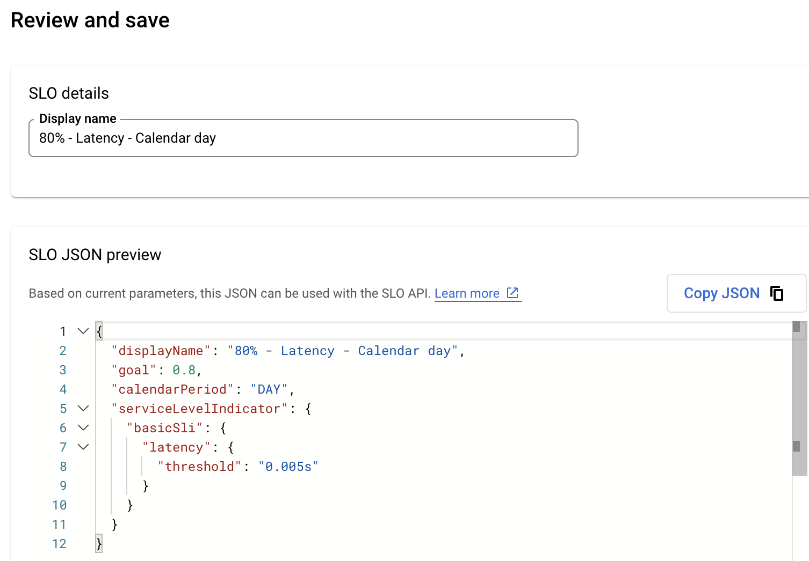
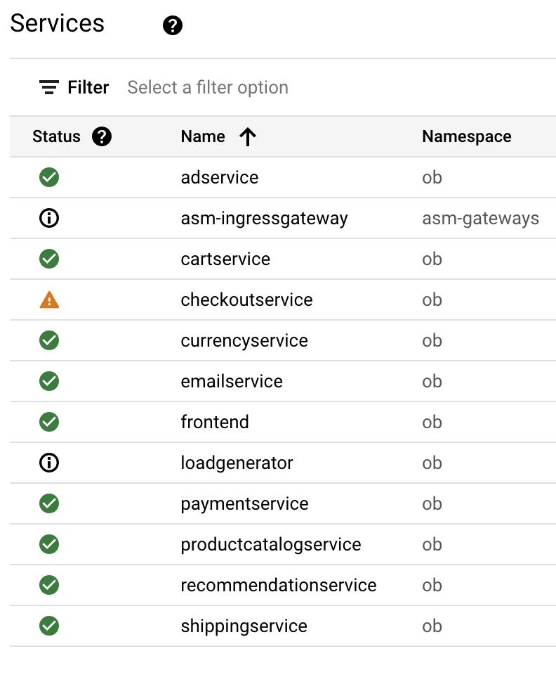
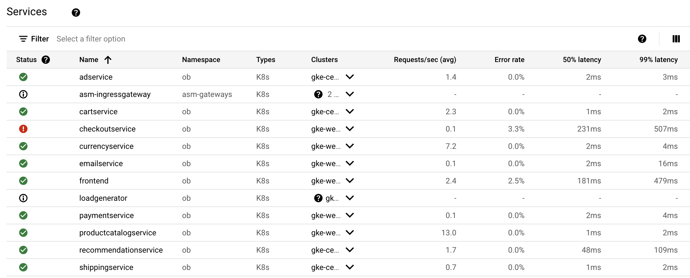
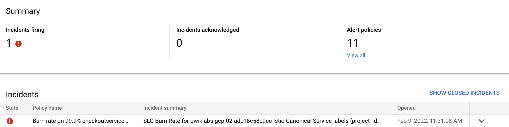

## Objective

Gain an understanding of the health of your services.  You can do this by creating [Service Level Objectives](https://cloud.google.com/service-mesh/docs/observability/slo-overview) (SLO) for [canonical services](https://cloud.google.com/service-mesh/docs/canonical-service) deployed in your environment.  In this lab, SLOs will be created for some canonical services deployed in the environment.  Observe how the Anthos Service Mesh (ASM) dashboard surfaces this information to you.  We will also change the behavior of a service using ASM to only respond correctly 50% of the time and generate an alert.

## Create an SLO using the UI

1. Navigate from the hamburger menu **Anthos > Service Mesh**

1. Select `ob` in the Namespace drop-down.

1. Notice some metrics already available with 3 of the 4 [golden signals](https://sre.google/sre-book/monitoring-distributed-systems/#xref_monitoring_golden-signals), Requests/sec, Error rate, and Latency.

    

1. Select `adservice` from the list of services

1. Select `Create An SLO`

    

1. We are going to set our Service Level Indicator, by determing the type of metric we want to set a performance goal on.  Select `Latency`, which is how long it takes to return a response to a request.

1. Next we need to set how we are going to set how the compliance is going to be measured, in this case `Request-based` and click `Continue`

    

1. SLI details are now required and we need to set our threshold.  ASM collects the raw data over a period of time and calculated as percentiles. Observe what the 50th, 95th and 99th percentiles are.  Enter a `3`ms for the latency threshold.

    > NOTE: Set a reasonable threshold, for instance the latency shouldn't be too low that it would be difficult to maintain with minimal impact to your end users / service.  Additional details on [setting SLI/SLOs](https://cloud.google.com/service-mesh/docs/observability/design-slo). 

       

1. [Compliance period](https://cloud.google.com/service-mesh/docs/observability/design-slo#compliance_periods) - In the lab we won't have enough time to generate enough data for a proper compliance period, but we will still need to set one.
    - Period type: Calendar
    - Period length: Calendar day


1. [Performance goal](https://cloud.google.com/stackdriver/docs/solutions/slo-monitoring?hl=he#defn-slo) - Setting a goal also creates an error budget, which is the total amount of time that a service can be non-compliant before it violates the SLO.  Set a goal of `80`% and click `Continue`

    > NOTE: A useful SLO is under 100%, because the SLO determines your error budget. SLOs are typically described as a “number of nines”: 99% (2 nines), 99.9% (3 nines), and so forth. The highest value you can set is 99.9%, but you can use any lower value that is appropriate for your service.

    

1.  SLO details are presented, a generated JSON preview can also be used via API to create/update an SLO.  Click `Create SLO`.

    

1. Observe your SLO.

    

## Use the APIs to create SLOs applicable services

1. You can manually use the UI to create individual SLOs.  However, we can use following script which uses the API to generate SLOs & alerts for the remaining applicable services.
    ```
    ${WORKDIR}/lab/workload/ops/asm-slo.sh \
      ${PROJECT_ID} ob
    ```

    ```
    # Output (Do not copy)
    ...
    POST LATENCY recommendationservice
    SLO_NAME is projects/745012302812/services/canonical-ist:proj-745012302812-ob-dev-recommendationservice/serviceLevelObjectives/K2n107PzTGmLvADUOh_T_w
    Created alert policy [projects/qwiklabs-gcp-01-ca67d11c5de3/alertPolicies/3685140218579828378].
    POST LATENCY shippingservice
    SLO_NAME is projects/745012302812/services/canonical-ist:proj-745012302812-ob-dev-shippingservice/serviceLevelObjectives/Ask7UzBTQba3qdzakemjcA
    Created alert policy [projects/qwiklabs-gcp-01-ca67d11c5de3/alertPolicies/12577200214731172412].
    ```

    > NOTE: In addition to creating a set of latency expectations for our services, we also created one avaialbility SLO for the `checkoutservice` of 99.9% for demonstration purposes.

1. Navigate from the hamburger menu **Anthos > Service Mesh**

1. Select `ob` in the Namespace drop-down.

1. Observe the status of the respective services in the `ob` namespace.  

    

1. Services can have the following statuses

    

## Trigger an alert

1. We need to create a problem, chaos monkey style, we will cause services (`frontend` and `checkoutservice`) to fail when they call `cartservice` 50% of the time.  In this lab, this will cause an alert to trigger on `checkoutservice` because it's having trouble reaching `cartservice` 50% of the time and we expect it to be avaialble 99.9% of the time.

1. Using Istio's `VirtualService` resource, we add a fault to the `cartservice`. 
    ```
    kubectl --context ${CLUSTER_1} \
      -n ob \
      apply -f ${WORKDIR}/anthos-multicloud-workshop/platform_admins/tests/ops/virtualservice-cartservice-50fault.yaml
    ```

1. You will start to see error rates increase for `frontend` and `checkoutservice`.  For demonstration purposes we created a 99.9% availability expectation of the `checkoutservice`, via API, which is dependent on the `cartservice`.  This will trigger an alert.

    

    > NOTE: It will take a few minutes (~3-5), for the checkout service to trigger the `checkoutservice` availability alert.
    
1. Test out the application in the browser, you will notice failure of the application about half the time.
    ```
    kubectl --context ${CLUSTER_1} get -n istio-system service istio-ingressgateway -o json | jq -r '.status.loadBalancer.ingress[0].ip'
    ```

1.  It may take some time for the alert to show up for the `checkoutservice`.  It can also be accessed through the Cloud Monitoring component.
    ```
    echo -e https://console.cloud.google.com/monitoring/alerting?project=${PROJECT_ID}
    ```

        

1. The service overview provides a general view.

    

1. The `checkoutservice` details

    